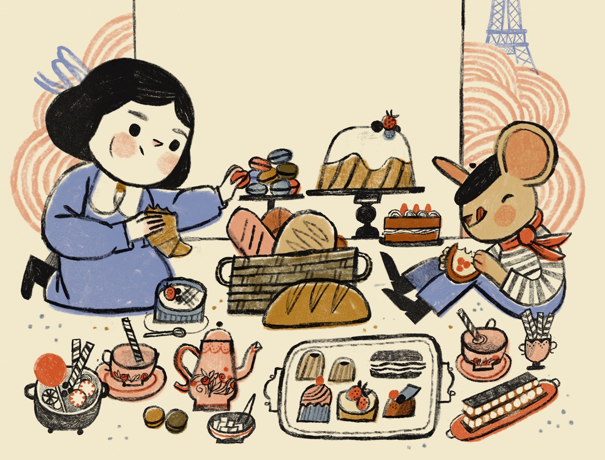
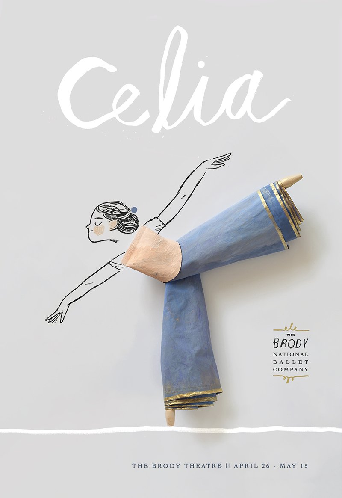

# Page 1

<figure><figcaption></figcaption></figure>

Gabrielle Vincent (1928 - 2000) was the pseudonym of Belgian painter Monique Martin. Martin was a successful fine artist and had shown in galleries exhibiting paintings, black and white ink/charcoal drawings and more. In 1980, she began to illustrate, though changed her name for illustrating because it was seen as a lower art in the eyes of her fine artist peers. In 1981, she created Ernest et Célestine, and went on to make 26 books in the series.

<figure><figcaption></figcaption></figure>

<figure><figcaption></figcaption></figure>
